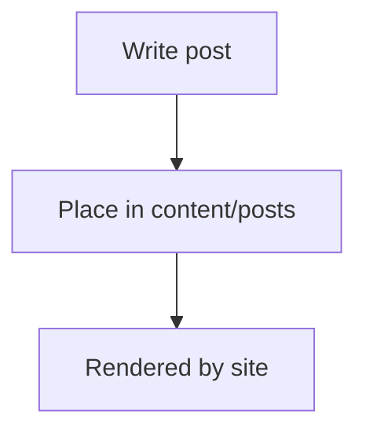

# Hello from the sample post

This is a local MDX post added to `content/posts` so the site can render blog posts without the TACOS backend.

- Add your markdown/MDX content here
- Use frontmatter fields like `slug`, `title`, `publishedAt`, `tags`, `draft`

